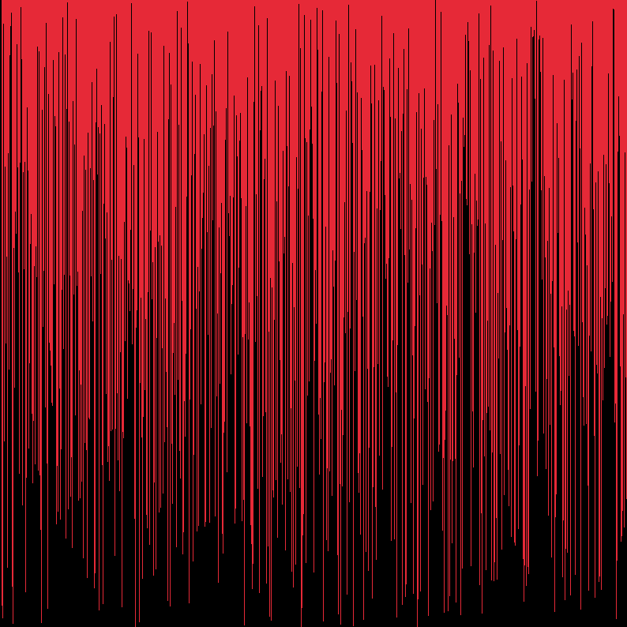
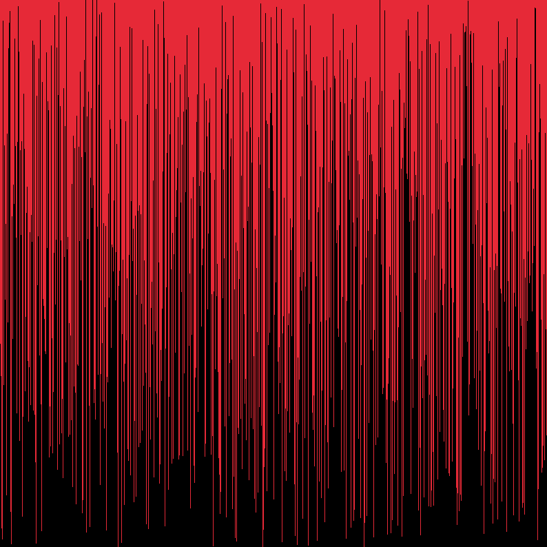
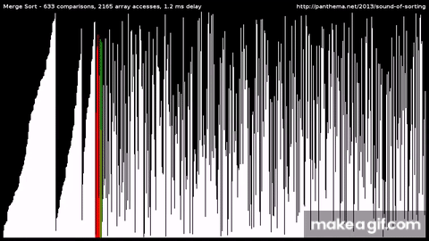

# Sorting Visualizer
Sorting Visualizer is an interactive web application that allows users to visualize and understand the inner workings of popular sorting algorithms. This tool provides a dynamic and engaging way to explore how data is organized step by step through animation and visual representation.

Features
🎨 Intuitive Visuals: Watch the sorting process in real-time with colorful bars representing data.
📚 Algorithms Included:
Bubble Sort
Selection Sort
Insertion Sort
Merge Sort
Quick Sort
⚙️ Customizable Options:
Adjust the array size and speed of visualization.
Shuffle the data to see different scenarios.
🖥️ Responsive Design: Works seamlessly across devices and screen sizes.
🕹️ User-Friendly Interface: Easily control the visualization with a few clicks.
Purpose
The Sorting Visualizer is designed to help beginners and enthusiasts gain a deeper understanding of sorting algorithms by providing a hands-on learning experience.

Visualization of selection, insertion, and bubble sort algorithms in c/c++ with the [raylib](https://github.com/raysan5/raylib) library. 
Includes functionality to choose between each type of sorting algorithm, shuffle lines, and reset app.

Below are demonstrations:

# Selection Sort

# Insertion Sort

# Bubble Sort

# Merge Sort

